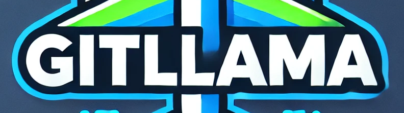

<div align="center">
<h1 align="center">gitllama</h1>

<h3>A CLI Tool to Generate Git Commit Messages with AI</h3>

<p align="center">


</p>
<p align="center">


</p>
</div>

---

📖 **About the Project**  
`gitllama` is a powerful command-line interface tool designed to leverage artificial intelligence for generating meaningful git commit messages based on your current changes. This tool streamlines the workflow of developers, allowing for clear and concise documentation of commits with minimal effort.

🎯 **Features**
- AI-generated commit messages based on the diff of staged changes.
- Options to automatically stage (`-y`) and push (`-p`) your changes.
- Simulation mode (`-s`) to preview commit messages without actual commits.
  
🚀 **Quick Start**

1. **Clone the repository:**
   ```bash
   git clone https://github.com/brngdsn/gitllama.git
   cd gitllama
   ```

2. **Install dependencies:**
   ```bash
   npm install
   ```

3. **Run the tool:**
   - To generate a commit message:
     ```bash
     npx gitllama commit
     ```
   - To stage all changes automatically:
     ```bash
     npx gitllama commit -y
     ```
   - To push changes to the remote repo:
     ```bash
     npx gitllama commit -y -p
     ```
   - To simulate the process:
     ```bash
     npx gitllama commit -s
     ```

🛠️ **Tech Stack**
- Node.js (v20.8.0)
- Command Line Interface: Commander
- AI Interaction: Ollama with Llama3.2 Model
- Console Styling: Chalk
- Loading Indicators: Ora
- Token Counting: js-tiktoken

📂 **Folder Structure**
```
.
├── bin/
│   └── gitllama.js
├── src/
│   ├── aiUtils.js
│   ├── commit.js
│   ├── gitUtils.js
│   └── tokenUtils.js
├── .gitignore
├── package.json
├── LICENSE
└── README.md
```

📜 **License & Credits**  
This project is licensed under the MIT License. See the [LICENSE](LICENSE) file for more information. Contributions are welcome, and please adhere to the code of conduct in your interactions and submissions.

---
For more information, visit our [GitHub Repository](https://github.com/brngdsn/gitllama). Enjoy using `gitllama` to streamline your commit processes!